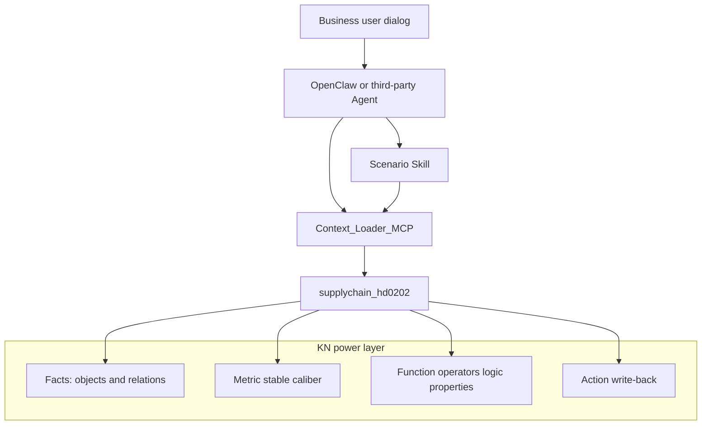

> **Experience pack note (hand edition)**  
> This document originally targeted KN `supplychain_hd0202`. In this experience pack use:  
> - Network name: `供应链本体知识网络-手工版` (Supply Chain Ontology — Hand Edition)  
> - Network ID: `supply_ontology_hand`  
> - Object type ID prefix: `supply_ontology_hand_*` (see `kn/supply_ontology_hand.json`)  
> Operational guide: [openbkn-hand-import-guide.md](./openbkn-hand-import-guide.md) · [中文版](./openbkn-hand-import-guide_cn.md) (steps 1–7, same directory).

---

# Third-Party Agent: Scenario-Driven Supply Chain KN Capability Architecture

[中文版 (Chinese)](./agent-scenario-kn-capability-design_cn.md)

> KN: `supplychain_hd0202` (HD Supply Chain BKN v3)  
> Date: 2026-08-01  
> Audience: OpenClaw / Context Loader / other third-party Agent authors  
> Principle: **scenario knowledge lives in KN Skills**; otherwise prefer **Metric / function operators / Action**; no dependency on supply-chain brain UI

Application panel matrix is in internal appendix `capability-placement` (not shipped in this sample; not used as navigation axis).

---

## 0. Core principle: Skills live on the knowledge network, not as local files

| Wrong | Right |
|-------|-------|
| Drop a `skills/**/SKILL.md` in a repo and call it done | Local folder is only a **registration source**; must `openbkn skill register` into the platform Skill registry and be recalled by `find_skills(kn_id, object_type_id)` |
| Skill = local script that computes everything | Skill = **knowledge orchestration contract**: guides Agent to call KN **Metric / logic properties·operators / Action** |
| Skill replaces metrics and actions | Skill **drives** logic and action execution; does not replace the ontology power layer |

Acceptance checklist:

1. Visible via `openbkn skill list/get` and `published`  
2. Context Loader: `find_skills` recalls on `supplychain_hd0202` + related OTs (product / mrp / bom)  
3. Skill body declares `bkn_scope`, `required_objects`, `required_logic` (metrics/operators), `callable_actions`  
4. Execution path: `search_schema` → read Metric / `get_logic_properties_values` → if needed `get_action_info` + confirm → `execute_action`

Repo path [`skills/production-schedule-backward-planning/`](../../skills/production-schedule-backward-planning/) = **source package / contract**.

**POC status (2026-08-01):**

| Item | Status |
|------|--------|
| `skill register` + `published` | Done |
| skill_id | `2ed09690-d9ba-4896-bd11-682d633196bc` |
| `skill content` readable | Verified |
| `find_skills(kn, object_type)` recall | **Blocked**: `ObjectTypeNotFound` (OT list exists) |
| Record | [poc-payloads/s1-skill-registered.json](./poc-payloads/s1-skill-registered.json) |

Temporary Agent load: `openbkn skill get/content 2ed09690-d9ba-4896-bd11-682d633196bc`; switch to KN recall when `find_skills` is fixed.

---

## 1. Goals

Enable third-party Agents to perform tasks equivalent to business-user collaboration **without opening the supply-chain brain frontend** — especially **production backward scheduling · kitting diagnosis**.

| Do not | Do |
|--------|-----|
| Wire metrics by cockpit/planning panels | Define **KN knowledge Skills** by **business scenario** |
| Encode backward scheduling in many Metrics | S1 scenario Skill orchestrates; reusable lead times as **logic properties** |
| Deliver only local Claude/Cursor skills | **Platform register** + KN recall |
| Agent re-computes modeled metrics via `run_sql` | Metrics read-only; gaps via platform `query_metric` (§5.3) |
| Auto PO / change delivery dates | Action + human confirmation |

```text
Business intent
 → Multi-step scenario orchestration (report / confirm / multi-object reasoning)?
    Yes → Skill
    No → Changes business facts?
         Yes → Action (governance)
         No → Stable aggregatable caliber?
              Yes → Metric
              No → Function / logic property / operator
```



Decoupled from in-repo OpenClaw UI integration plan: that wires brain UI to OpenClaw gateway; this doc is **Agent-side KN + Skill**.

---

## 2. Scenario map (Agent view)

| Scenario ID | Business goal | Capability form | Contract / anchor |
|-------------|-----------------|-------------------|-------------------|
| **S1** | Production backward schedule · kitting diagnosis | **KN knowledge Skill** (orchestrates Metric/logic/Action) | Source [`skills/production-schedule-backward-planning/`](../../skills/production-schedule-backward-planning/) → must `skill register` to POC; rules from `ganttService` / `supplyStatusService` |
| S2 | Demand acceptance · sellable capacity | **Skill** | `demand-fulfillment-capacity-analysis` |
| S3 | Demand acceptance · new requirement coverage | **Skill** | `demand-fulfillment-requirement-coverage-analysis` |
| S4 | Network scale / inventory dashboard numbers | **Metric** | [p0-metrics-created-ids.json](./poc-payloads/p0-metrics-created-ids.json) |
| S5 | Monitor task lifecycle | **Action** | `create_monitor_task`; update/close in drafts |
| S6 | Procurement expedite / convert to PO | **Action** + governance | `initiate_po` **no automation** |

P0 flagship: **S1** (this doc §3 + Skill package). S2/S3 reuse existing Skills; not rewritten in this phase.

---

## 3. Flagship scenario S1: backward schedule · kitting diagnosis

### 3.1 Intent and boundaries

**Example utterances:** kitting backward schedule, production backward plan, when materials arrive, A/B delay classes, can we kit by due date.

**Skill does:** BOM-level backward schedule, supply status, A/B delay lists, Markdown diagnosis report.  
**Skill does not:** write monitor tasks (Action), pure object counts (Metric), auto PO.

### 3.2 Inputs

| Layer | Field | Notes |
|-------|-------|-------|
| User | `knowledge_network_id` | Default `supplychain_hd0202`; use `supply_ontology_hand` in hand pack |
| User | `product_query` | Product code or name |
| User | `demand_end` | Demand/production deadline (YYYY-MM-DD); or parseable forecast/monitor task id |
| User | `demand_qty` | Optional |
| User | `production_start` | Optional; earliest backward start may backfill |
| System | BOM / material / inventory / mrp / pr / po | Single snapshot via Context Loader / `$kweaver-core` / ontology-query |

### 3.3 KN objects and relations

| Object type ID (POC) | Hand pack equivalent | Purpose |
|----------------------|----------------------|---------|
| `supplychain_hd0202_product` | `supply_ontology_hand_product` | Anchor product |
| `supplychain_hd0202_material` | `supply_ontology_hand_material` | Lead time, make/buy |
| `supplychain_hd0202_bom` | `supply_ontology_hand_bom` | Level explode (main line `alt_priority==0`) |
| `supplychain_hd0202_inventory` | `supply_ontology_hand_inventory` | Effective warehouse available qty |
| `supplychain_hd0202_mrp` | `supply_ontology_hand_mrp` | Net requirement exists |
| `supplychain_hd0202_pr` / `_po` | `supply_ontology_hand_pr` / `_po` | PR/PO status and dates |
| `supplychain_hd0202_forecast` | `supply_ontology_hand_forecast` | Optional: parse window from forecast |
| `supplychain_hd0202_monitoring_task` | `supply_ontology_hand_mon_task` | Optional context; write-back via Action |

Auxiliary Metrics (not core to backward schedule): effective warehouse available stock total `d9mmiu1o7ptc738tkbh0`, forecast demand total `d9mmiu1o7ptc738tkbhg`.

### 3.4 Core rules (aligned with application)

**Backward schedule (aligned with `ganttService`):**

1. L0: `end = demand_end`; `start = end - product_fixedleadtime` (days)
2. Child: `child_end = parent_start - 1` day
3. Lead time: buy/outsource → `purchase_fixedleadtime`; make → `product_fixedleadtime`
4. Bar length: if `isFulfilled = !hasMRP && (available + in_transit) > 0` then leadtime=1, else `max(standardLeadtime, 1)`
5. `child_start = child_end - ganttLeadtime`
6. BOM BFS parent→child; skip cycles; node cap 5000

**Supply status (aligned with `supplyStatusService`, first match):**

- `supply = available + in_transit`; if `supply >= grossRequirement` → `sufficient`
- Buy/outsource: no MRP→`anomaly`; PO overdue→`po_overdue`; PO date after end→`deadline_risk`; no PO and lead time insufficient→`deadline_risk`; no PR→`no_pr`; PR without PO→`no_po`; else `po_in_transit`
- Make: child shortage→`child_short`; no MRP→`unscheduled`; else `plan_gap`

**A/B delays (aligned with `getGanttSummary`):**

- **Class A**: buy/outsource, backward `start < today`, no PO, stock insufficient; delay days = order today vs standard lead vs `end`
- **Class B**: has PO and `poDeliverDate >` backward `end`

### 3.5 Output and completion gate

Output must include: structured `analysis_result` (flat/tree schedule, delayTypeA/B, supply status summary) + full Markdown report.

Completion gates per Skill package; terminate if unmet — do not invent delivery dates.

### 3.6 Eval

Fixed `product_code` + `demand_end`; compare node `startDate`/`endDate` and A/B sets with application `ganttService` (calendar-day alignment, local timezone).

---

## 4. Prefer fixing on KN (not in Skill)

### 4.1 Metrics (created in POC)

| Name | metric id | scope |
|------|-----------|-------|
| Product count | `d9mmiu1o7ptc738tkbeg` | product |
| Material count | `d9mmiu1o7ptc738tkbf0` | material |
| Supplier count | `d9mmiu1o7ptc738tkbfg` | supplier |
| Sales order count | `d9mmiu1o7ptc738tkbg0` | salesorder |
| Warehouse count | `d9mmiu1o7ptc738tkbgg` | inventory |
| Effective warehouse available total | `d9mmiu1o7ptc738tkbh0` | inventory |
| Forecast demand total | `d9mmiu1o7ptc738tkbhg` | forecast |
| Open forecast count | `d9mmiu1o7ptc738tkbi0` | forecast |

Query: `POST /api/ontology-query/v1/knowledge-networks/{kn}/metrics/{id}/data`  
CLI: `openbkn bkn metric query supplychain_hd0202 <id> --body '{}'`

P1 candidates (still Metric): overdue order count, PR lines pending PO, overdue PO lines.

### 4.2 Functions / logic properties (recommended on KN for Skill reuse)

| Name | Semantics | Notes |
|------|-----------|-------|
| `material_leadtime_days` | Pick purchase/make fixed lead by materialattr | Backward bar input |
| `remaining_open_qty` | qty − actqty / joinqty | PR/PO |
| `production_available_qty` | Effective warehouse + available status sum | Same caliber as Metric; instance-level logic property OK |

Until platform binding, Skill computes same formulas and declares caliber in report.

### 4.3 Actions

| Action | Status | Agent usage |
|--------|--------|-------------|
| `create_monitor_task` | Exists | After backward schedule, user confirms |
| `update_monitor_task` / `close_monitor_task` | Draft | [action-drafts-monitor-lifecycle.json](./poc-payloads/action-drafts-monitor-lifecycle.json) |
| `initiate_po` | On platform, no auto | Suggest only; human confirm |

---

## 5. Third-party Agent consumption protocol

### 5.1 Standard orchestration

```text
1. list_knowledge_networks → pick kn_id (default supplychain_hd0202; hand pack: supply_ontology_hand)
2. search_schema(query, include_metric_types=true)
   → confirm objects / relations / metric_types
3. Intent routing:
   a. S1/S2/S3 scenarios → find_skills / mount Skill → execute
   b. S4 totals / inventory KPI → query_metric(metric_id) (when platform ready)
   c. S5 monitor write-back → get_action_info → show params → user confirm → execute_action
   d. S6 PO / expedite → suggest + risk only; no unattended execute
4. Forbidden: run_sql to recompute modeled Metrics like "product count"
5. Forbidden: skip Action definition and call external APIs with high impact
```

### 5.2 Intent → capability quick reference

| User says (examples) | Route |
|----------------------|-------|
| How many products/materials/suppliers | Metric: product/material/supplier count |
| Effective warehouse stock for a material | Metric: effective warehouse available total (by material_code) |
| Kit backward schedule / delivery risk | **Skill S1** |
| Max sellable qty for this product | **Skill S2** |
| Can these new demands be met | **Skill S3** |
| Create kitting monitor task | **Action** `create_monitor_task` |
| Place PO to supplier directly | **Reject auto**; explain human step + `initiate_po` |

### 5.3 Platform dependencies and temporary fallback

| Capability | Status | Agent temporary path |
|------------|--------|----------------------|
| `search_schema` discovers metrics | Available | MCP |
| `query_metric` MCP tool | **Missing** → [bkn-foundry#597](https://github.com/openbkn-ai/bkn-foundry/issues/597) | OAuth + `openbkn bkn metric query` / ontology-query data API |
| Composite metric condition | Gap → [#594](https://github.com/openbkn-ai/bkn-foundry/issues/594) | Single-layer condition or filter in Skill |
| validate path | [#593](https://github.com/openbkn-ai/bkn-foundry/issues/593) | Use create/query acceptance |
| `get_kn_detail` includes metrics | No | Rely on search_schema |
| OT-bound logic property → metric | Unbound | Class KPI via metric query; do not treat as instance logic property |

**Risk:** Agents with Context Loader AppKey only may **find but not compute** metrics; S1 Skill must fetch facts via `$kweaver-core` / ontology-query instances — do not assume `query_metric` works.

### 5.4 Knowledge Skill register and recall

```bash
# 1) Register source package to platform (POC)
openbkn skill register skills/production-schedule-backward-planning \
  --source supplychain_hd0202 \
  --extend-info '{"kn_id":"supplychain_hd0202","scene":"S1","object_types":["supplychain_hd0202_product","supplychain_hd0202_bom","supplychain_hd0202_mrp"]}'

# 2) Publish
openbkn skill set-status <skill_id> published

# 3) Agent recall (Context Loader)
# find_skills(kn_id=supplychain_hd0202, object_type_id=supplychain_hd0202_product, skill_query=kitting backward)
```

Skill execution = knowledge orchestration only: fetch facts → read Metric/logic → interpret rules → **propose** Action for monitor tasks; no silent execute.

### 5.5 OpenClaw mount suggestions

1. Depend on **published** platform Skill (not local folder only)  
2. Configure KN: `supplychain_hd0202` (hand pack: `supply_ontology_hand`) + POC + OAuth/MCP  
3. System prompt references §5.1–5.2: scenario→`find_skills`, KPI→Metric, write-back→Action  
4. No dependency on supply-chain brain Copilot panels

---

## 6. Related documents

| Document | Role |
|----------|------|
| **This doc** | Agent × scenario × KN main architecture |
| `capability-placement` (internal, not in sample) | Application panel view / three-way split appendix |
| OpenClaw UI integration (in-repo plan) | Brain-embedded dialog backend, not KN capability ontology |

---

## 7. Acceptance

- [x] Third-party Agent authors can answer: backward schedule → Skill, product count → Metric, open monitor → Action  
- [x] S1 Skill contract includes input/rules/output/completion gate/Eval  
- [x] Documents fallback and risk when `query_metric` is missing  
- [x] No modification to supply-chain brain business UI in this phase
