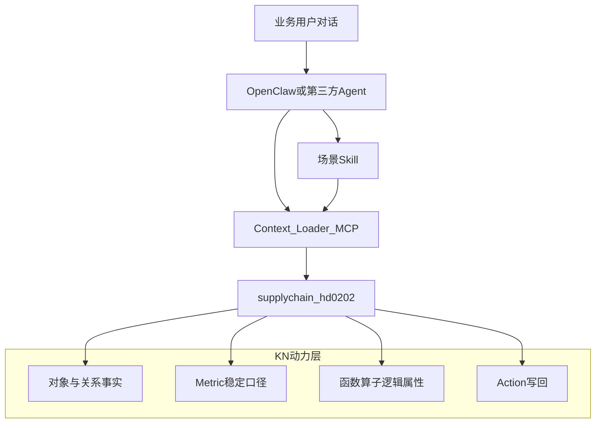

> **已废止作为本体验包主设计（2026-08-13）**  
> 本文仍描述 KN `supplychain_hd0202`（成品 431、仓名昆山/新疆），**不能**用于本包验证。  
> 请改用：  
> - [场景驱动的供应链动态能力设计](./场景驱动的供应链动态能力设计.md)  
> - [能力口径清单](./能力口径清单.md)  
> - [业务问答测试集](./业务问答测试集.md)  
> - [Agent 导入验证清单](./Agent导入验证清单.md)  
> 操作入口：[openbkn-hand-import-guide_cn.md](./openbkn-hand-import-guide_cn.md)  

---

# 第三方 Agent：场景驱动的供应链 KN 能力架构

[English](./agent-scenario-kn-capability-design.md)

> KN：`supplychain_hd0202`（HD供应链业务知识网络_v3）  
> 日期：2026-08-01  
> 受众：OpenClaw / Context Loader / 其他第三方 Agent 作者  
> 原则：**场景用知识网络 Skill**；其余尽量落到 **Metric / 函数算子 / Action**；不依赖供应链大脑 UI

应用视角的面板矩阵见内部附录 `capability-placement`（本 sample 未发布，不以导航为轴）。

---

## 0. 基本原则：Skill 落在知识网络，不是本地文件

| 错误理解 | 正确理解 |
|----------|----------|
| 仓库里放一份 `skills/**/SKILL.md` 就算交付 | 本地目录只是**注册源包**；必须经 `openbkn skill register` 进入平台 Skill 注册中心，并被 `find_skills(kn_id, object_type_id)` 召回 |
| Skill = 本地脚本把业务算完 | Skill = **知识类编排契约**：指导 Agent 调用 KN 上的 **Metric / 逻辑属性·算子 / Action** |
| Skill 替代指标与行动 | Skill **推动执行** logic 与 action，本身不取代本体动力层 |

落地验收：

1. `openbkn skill list/get` 可见且 `published`  
2. Context Loader：`find_skills` 在 `supplychain_hd0202` + 相关对象类（如 product / mrp / bom）上能召回  
3. Skill 正文声明 `bkn_scope`、`required_objects`、`required_logic`（指标/算子）、`callable_actions`  
4. 执行路径优先：`search_schema` → 读 Metric / `get_logic_properties_values` → 必要时 `get_action_info` + 确认后 `execute_action`

仓库路径 [`skills/production-schedule-backward-planning/`](../../skills/production-schedule-backward-planning/) = **源包/契约**。

**POC 落地状态（2026-08-01）：**

| 项 | 状态 |
|----|------|
| `skill register` + `published` | 已完成 |
| skill_id | `2ed09690-d9ba-4896-bd11-682d633196bc` |
| `skill content` 可读 | 已验证 |
| `find_skills(kn, object_type)` 召回 | **阻塞**：`ObjectTypeNotFound`（OT 列表实际存在） |
| 记录 | [poc-payloads/s1-skill-registered.json](./poc-payloads/s1-skill-registered.json) |

Agent 临时加载：`openbkn skill get/content 2ed09690-d9ba-4896-bd11-682d633196bc`，待 `find_skills` 修复后改为 KN 召回。

---

## 1. 目标

让第三方 Agent 在**不打开供应链大脑前端**的前提下，基于同一知识网络完成与业务人员协作等价的任务——尤其是 **生产计划倒排 · 齐套诊断**。

| 不做 | 要做 |
|------|------|
| 按驾驶舱/计划页面板接指标 | 按**业务场景**定义 **KN 知识类 Skill** |
| 把倒排写进十几个 Metric | 倒排场景 Skill 编排；可复用提前期等进 **逻辑属性** |
| 仅本地 Claude/Cursor skill | **平台注册** + KN 召回 |
| Agent 用 `run_sql` 重算已建模口径 | Metric 只读；缺口走平台 `query_metric`（见 §5.3） |
| 自动转 PO / 改交期 | Action + 人工确认 |

```text
业务意图
 → 是否多步场景编排（报告/确认/多对象推理）？
    是 → Skill
    否 → 是否改变业务事实？
         是 → Action（治理）
         否 → 是否稳定可聚合口径？
              是 → Metric
              否 → 函数 / 逻辑属性 / 算子
```



与仓库内 [OpenClaw 对话集成计划](../superpowers/plans/2026-04-24-openclaw-integration.md) **解耦**：后者是大脑 UI 接 OpenClaw 网关；本文是 **Agent 侧挂 KN + Skill**。

---

## 2. 场景地图（Agent 视角）

| 场景 ID | 业务目标 | 能力形态 | 契约 / 锚点 |
|---------|----------|----------|-------------|
| **S1** | 生产计划倒排 · 齐套诊断 | **KN 知识类 Skill**（编排 Metric/逻辑/Action） | 源包 [`skills/production-schedule-backward-planning/`](../../skills/production-schedule-backward-planning/) → 须 `skill register` 到 POC；规则口径源自 `ganttService` / `supplyStatusService` |
| S2 | 需求承接 · 可售能力 | **Skill** | `demand-fulfillment-capacity-analysis` |
| S3 | 需求承接 · 新需求覆盖 | **Skill** | `demand-fulfillment-requirement-coverage-analysis` |
| S4 | 网络规模 / 库存看板数字 | **Metric** | [p0-metrics-created-ids.json](./poc-payloads/p0-metrics-created-ids.json) |
| S5 | 监测任务生命周期 | **Action** | `create_monitor_task`；update/close 见草案 |
| S6 | 采购催货 / 转 PO | **Action** + 治理 | `initiate_po` **禁止自动** |

P0 标杆：**S1**（本文 §3 + Skill 包）。S2/S3 复用已有 Skill，不在本阶段重写。

---

## 3. 标杆场景 S1：生产计划倒排 · 齐套诊断

### 3.1 意图与边界

**触发话术示例：** 齐套倒排、生产计划倒排、物料何时到位、A/B 类延迟、能否按交期齐套。

**Skill 做：** BOM 层级倒排、供应状态、A/B 延迟清单、Markdown 诊断报告。  
**Skill 不做：** 写监测任务（交给 Action）、纯对象 count（交给 Metric）、自动下 PO。

### 3.2 输入

| 层 | 字段 | 说明 |
|----|------|------|
| 用户 | `knowledge_network_id` | 默认 `supplychain_hd0202` |
| 用户 | `product_query` | 产品编码或名称 |
| 用户 | `demand_end` | 需求/生产截止日（YYYY-MM-DD）；或可解析的预测单/监测任务 id |
| 用户 | `demand_qty` | 可选 |
| 用户 | `production_start` | 可选；缺省可由倒排最早 start 回填 |
| 系统 | BOM / material / inventory / mrp / pr / po | 经 Context Loader / `$kweaver-core` / ontology-query **单次快照** |

### 3.3 KN 对象与关系

| 对象类型 ID | 用途 |
|-------------|------|
| `supplychain_hd0202_product` | 锚定产品 |
| `supplychain_hd0202_material` | 提前期、外购/自制 |
| `supplychain_hd0202_bom` | 层级展开（主料 `alt_priority==0`） |
| `supplychain_hd0202_inventory` | 有效仓可用量 |
| `supplychain_hd0202_mrp` | 是否有净需求记录 |
| `supplychain_hd0202_pr` / `_po` | PR/PO 状态与交期 |
| `supplychain_hd0202_forecast` | 可选：从预测单解析窗口 |
| `supplychain_hd0202_monitoring_task` | 可选：任务上下文；写回走 Action |

辅助 Metric（非倒排核心）：有效仓可用库存合计 `d9mmiu1o7ptc738tkbh0`、预测需求量合计 `d9mmiu1o7ptc738tkbhg`。

### 3.4 核心规则（与应用对齐）

**倒排（对齐 `ganttService`）：**

1. L0：`end = demand_end`；`start = end - product_fixedleadtime`（天）
2. 子件：`child_end = parent_start - 1` 天
3. 提前期：外购/委外 → `purchase_fixedleadtime`；自制 → `product_fixedleadtime`
4. 条长：`isFulfilled = !hasMRP && (available + in_transit) > 0` 时 leadtime=1，否则 `max(standardLeadtime, 1)`
5. `child_start = child_end - ganttLeadtime`
6. BOM 按 parent→child BFS；环路跳过；节点上限 5000

**供应状态（对齐 `supplyStatusService`，顺序匹配）：**

- `supply = available + in_transit`；`supply >= grossRequirement` → `sufficient`
- 外购/委外：无 MRP→`anomaly`；PO 已过期→`po_overdue`；PO 交期晚于 end→`deadline_risk`；无 PO 且提前期不够→`deadline_risk`；无 PR→`no_pr`；有 PR 无 PO→`no_po`；否则 `po_in_transit`
- 自制：子件缺口→`child_short`；无 MRP→`unscheduled`；否则 `plan_gap`

**A/B 延迟（对齐 `getGanttSummary`）：**

- **A 类**：外购/委外，倒排 `start < today`，无 PO，库存不满足；延迟天 = 今天下单按标准交期到货相对 `end` 的超出
- **B 类**：有 PO，且 `poDeliverDate >` 倒排 `end`

### 3.5 输出与完成门槛

输出必须含：结构化 `analysis_result`（倒排扁平/树、delayTypeA/B、供应状态汇总）+ 完整 Markdown 报告。

完成门槛见 Skill 包；未满足则终止，禁止编造交期。

### 3.6 Eval

固定 `product_code` + `demand_end`，对比应用侧 `ganttService` 构建结果的节点 `startDate`/`endDate` 与 A/B 集合（日期允许同日历日对齐，时区按本地日切）。

---

## 4. KN 上优先固化（非 Skill）

### 4.1 Metric（已在 POC 创建）

| 名称 | metric id | scope |
|------|-----------|-------|
| 产品总数 | `d9mmiu1o7ptc738tkbeg` | product |
| 物料总数 | `d9mmiu1o7ptc738tkbf0` | material |
| 供应商总数 | `d9mmiu1o7ptc738tkbfg` | supplier |
| 销售订单数 | `d9mmiu1o7ptc738tkbg0` | salesorder |
| 仓库数 | `d9mmiu1o7ptc738tkbgg` | inventory |
| 有效仓可用库存合计 | `d9mmiu1o7ptc738tkbh0` | inventory |
| 预测需求量合计 | `d9mmiu1o7ptc738tkbhg` | forecast |
| 未关闭预测单数 | `d9mmiu1o7ptc738tkbi0` | forecast |

查询：`POST /api/ontology-query/v1/knowledge-networks/{kn}/metrics/{id}/data`  
CLI：`openbkn bkn metric query supplychain_hd0202 <id> --body '{}'`

P1 候选（仍是 Metric，不是 Skill）：订单逾期笔数、PR 待转单行数、PO 逾期行数。

### 4.2 函数 / 逻辑属性（建议进 KN，供 Skill 复用）

| 名称 | 语义 | 备注 |
|------|------|------|
| `material_leadtime_days` | 按 materialattr 选采购/生产固定提前期 | 倒排条长输入 |
| `remaining_open_qty` | qty − actqty / joinqty | PR/PO |
| `production_available_qty` | 有效仓 + 可用状态汇总 | 与 Metric 口径一致；单实例可用逻辑属性 |

在平台支持绑定前，Skill 内用同一公式计算，并在报告中声明口径。

### 4.3 Action

| Action | 状态 | Agent 用法 |
|--------|------|------------|
| `create_monitor_task` | 已有 | 倒排后用户确认再执行 |
| `update_monitor_task` / `close_monitor_task` | 草案 | [action-drafts-monitor-lifecycle.json](./poc-payloads/action-drafts-monitor-lifecycle.json) |
| `initiate_po` | 平台有、禁自动 | 仅建议，须人工确认 |

---

## 5. 第三方 Agent 消费协议（路由清单）

### 5.1 标准编排

```text
1. list_knowledge_networks → 选定 kn_id（默认 supplychain_hd0202）
2. search_schema(query, include_metric_types=true)
   → 确认对象 / 关系 / metric_types
3. 意图路由：
   a. S1/S2/S3 场景 → find_skills / 挂载对应 Skill → 执行 Skill
   b. S4 总量/库存 KPI → query_metric(metric_id)（待平台）
   c. S5 写回监测 → get_action_info → 展示参数 → 用户确认 → execute_action
   d. S6 转 PO / 催货 → 只输出建议 + 风险；禁止无人值守 execute
4. 禁止：对已建模 Metric 用 run_sql 重算「产品总数」等
5. 禁止：跳过 Action 定义直接调高影响外部 API
```

### 5.2 意图 → 能力速查

| 用户说法（例） | 路由 |
|----------------|------|
| 有多少产品/物料/供应商 | Metric：产品/物料/供应商总数 |
| 有效仓某物料可用库存 | Metric：有效仓可用库存合计（按 material_code） |
| 帮我做齐套倒排 / 分析交期风险 | **Skill S1** |
| 这款产品最多能卖多少 | **Skill S2** |
| 这几条新需求能否满足 | **Skill S3** |
| 创建齐套监测任务 | **Action** `create_monitor_task` |
| 直接给供应商下 PO | **拒绝自动**；说明需人工 + `initiate_po` |

### 5.3 平台依赖与临时降级

| 能力 | 状态 | Agent 临时路径 |
|------|------|----------------|
| `search_schema` 发现 metric | 可用 | MCP |
| `query_metric` MCP 工具 | **缺失** → [bkn-foundry#597](https://github.com/openbkn-ai/bkn-foundry/issues/597) | OAuth + `openbkn bkn metric query` / ontology-query data API（AppKey 往往不够） |
| 复合 metric condition | 缺口 → [#594](https://github.com/openbkn-ai/bkn-foundry/issues/594) | 单层 condition 或 Skill 内过滤 |
| validate 路径 | [#593](https://github.com/openbkn-ai/bkn-foundry/issues/593) | 用 create/query 验收 |
| `get_kn_detail` 含 metrics | 否 | 依赖 search_schema |
| 对象类挂载逻辑属性→指标 | 未绑 | 类级 KPI 走 metric query，勿当实例 logic property 执行 |

**风险：** 仅持 Context Loader AppKey 的 Agent 目前**找得到指标、算不准/算不了**；S1 Skill 必须自带事实取数路径（`$kweaver-core` / ontology-query 对象实例），不能假设 `query_metric` 已通。

### 5.4 知识类 Skill 注册与召回（落地步骤）

```bash
# 1) 用源包注册到平台（POC）
openbkn skill register skills/production-schedule-backward-planning \
  --source supplychain_hd0202 \
  --extend-info '{"kn_id":"supplychain_hd0202","scene":"S1","object_types":["supplychain_hd0202_product","supplychain_hd0202_bom","supplychain_hd0202_mrp"]}'

# 2) 发布
openbkn skill set-status <skill_id> published

# 3) Agent 侧召回（Context Loader）
# find_skills(kn_id=supplychain_hd0202, object_type_id=supplychain_hd0202_product, skill_query=齐套倒排)
```

Skill 执行时只做知识编排：拉对象事实 → 读 Metric/逻辑属性 → 按规则解释 → 若需监测则 **proposal** Action，禁止默默 execute。

### 5.5 OpenClaw 挂载建议

1. 依赖**已 published** 的平台 Skill（非仅本地目录）  
2. 配置 KN：`supplychain_hd0202` + POC + OAuth/MCP  
3. System 提示引用 §5.1–5.2：场景→`find_skills`，KPI→Metric，写回→Action  
4. 不依赖供应链大脑 Copilot 面板

---

## 6. 与旧文档关系

| 文档 | 定位 |
|------|------|
| **本文** | Agent × 场景 × KN 主架构 |
| `capability-placement`（内部附录，本 sample 未发布） | 应用面板视角素材 / 三分法细则附录 |
| [OpenClaw UI 集成](../superpowers/plans/2026-04-24-openclaw-integration.md) | 大脑内嵌对话后端，非 KN 能力本体 |

---

## 7. 验收

- [x] 第三方 Agent 作者可回答：倒排越 Skill，产品总数走 Metric，开监测走 Action  
- [x] S1 Skill 契约含输入/规则/输出/完成门槛/Eval  
- [x] 写明缺 `query_metric` 时的降级与风险  
- [x] 不修改供应链大脑业务 UI（本阶段）
